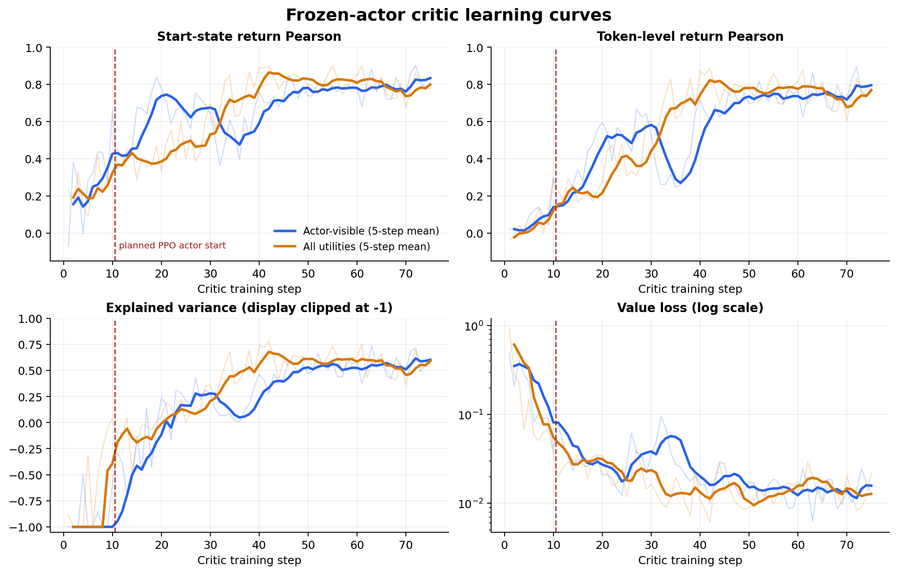
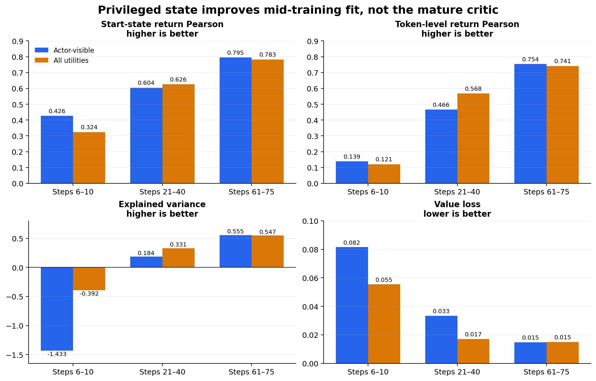

# Privileged critic: frozen-actor result

## Question

The hiring game is partially observable: each professor sees only its own game view, while its return depends on the full utility landscape and the other professors' behavior.

The treatment gives the **critic only** a table of every professor's utility for every student. The actor still receives the ordinary prompt and generates the same response tokens.

Hypothesis:

```text
More complete critic state
        -> better return prediction
        -> better advantages
        -> better PPO learning
```

## Finished comparison

The actor was frozen for all 75 steps. Both runs used Qwen3-4B, the same critic architecture, value head, rewards, GAE, optimizer, batches, and sampled actor actions. Only the critic observation changed.

| Run | Critic observation | W&B |
| --- | --- | --- |
| `frozencritic_23238` | Actor-visible prompt | [`zuz5ag7n`](https://wandb.ai/szopa-michala/unscripted/runs/zuz5ag7n) |
| `allutils-frozen_23240` | Actor-visible prompt plus all utilities | [`fvagz4xj`](https://wandb.ai/szopa-michala/unscripted/runs/fvagz4xj) |



The privileged critic improves faster in the middle of training. Over steps 21–40, it has higher token-level return correlation (`0.568` vs `0.466`), higher explained variance (`0.331` vs `0.184`), and lower value loss (`0.017` vs `0.033`).

That advantage does not persist. Over steps 61–75, the critics are effectively tied:

- start-state return Pearson: `0.795` actor-visible vs `0.783` all-utilities;
- token-level return Pearson: `0.754` vs `0.741`;
- explained variance: `0.555` vs `0.547`;
- value loss: `0.01475` vs `0.01496`.



## Conclusion

The strong hypothesis—**privileged utilities produce a better mature critic**—is not supported by these runs. The weaker claim—**privileged utilities accelerate critic fitting**—has some support.

The planned 10-step critic warmup is too short for either condition: mean explained variance over steps 6–10 is still negative (`-1.433` actor-visible, `-0.392` all-utilities). The downstream hypothesis that privileged critics improve PPO policy learning remains untested until the actor-training pair completes.

This is one stochastic run per condition, without episode-level pairing, and the runs used different hardware. The result is diagnostic rather than statistically conclusive.
