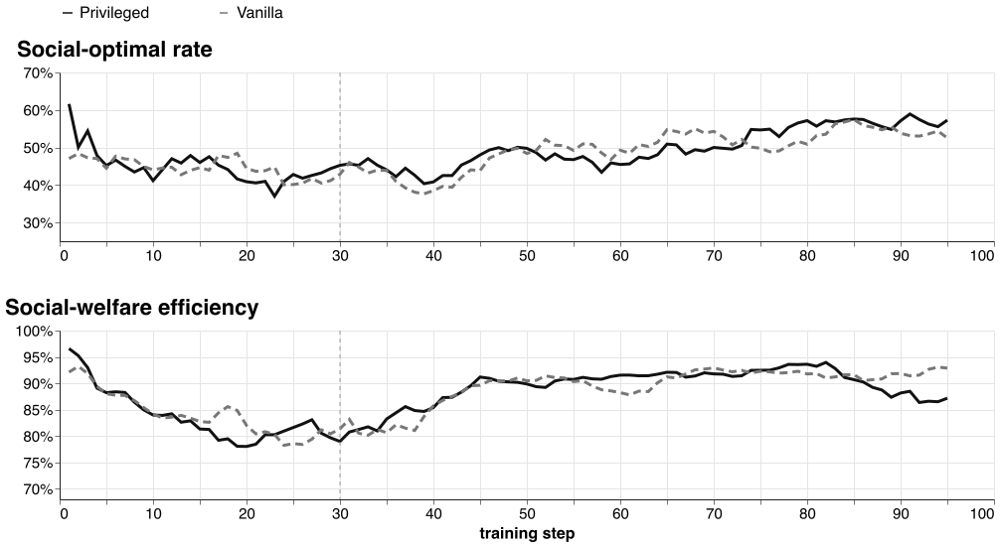
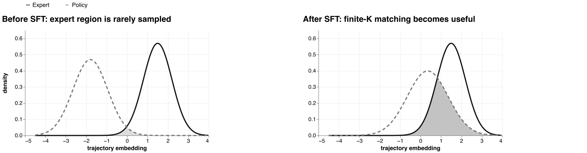

<!-- _class: lead -->

# Longer critic warmup resolves the fit problem

## …but privileged information does not yield a clear policy advantage

Matched actor-compute experiments · Qwen3-4B · 95 training steps

---

# Executive result

Warmup: supported

Both critics reached approximately **0.50 explained variance by step 30** and approximately **0.72–0.78 median EV late in joint training**.

Actor effect: mixed

Privileged ends higher on social-optimal choice rate. Vanilla ends higher on consensus and welfare efficiency.

> Warmup solved the critic optimization problem. Better critic information did not translate into a broad policy-quality gain.

---

# Three questions organize the experiment

1. **Can the critic learn?** — longer warmup should produce stable fit through joint training.

2. **Does privileged information improve value prediction?** — privileged should outperform vanilla.

3. **Does a privileged critic improve the actor?** — social outcomes should improve consistently.

> Critic fit and policy quality are separate outcomes.

---

# Only the critic’s input changed

Policy side — identical

Actor-visible prompt → sampled response

→

Critic side — treatment

Evaluate the same response with one of two prompts

## Vanilla

Exact actor-visible prompt

## Privileged

Same prompt + all utilities  
approximately 174 additional tokens

Held fixed: Qwen3-4B · 30 critic-only steps · 65 joint steps · same rewards, actor compute, and commit

---

# At the end of warmup, privileged and vanilla were tied

0.501

Privileged

0.498

Vanilla

> After 30 warmup steps, all critics reached approximately **0.50 explained variance**. The privileged input showed no advantage at this boundary.

---

# Strong critic fit persisted during joint training

| Run | End of warmup | Late joint median | Peak EV |
|---|---:|---:|---:|
| Privileged | 0.501 | **0.748** | 0.847 |
| Vanilla | 0.498 | 0.721 | 0.861 |

> Joint training did not destroy critic fit. The late-median difference was only **0.027**, so single-checkpoint comparisons are not reliable.

---

# Actor outcomes improved in different ways

Seven-step trailing mean · actor updates after step 30 · late medians: social optimal 57% vs. 52%; welfare 87% vs. 93%

---

# Actor outcomes differ by objective

| Outcome | Meaning | Privileged | Vanilla |
|---|---|---:|---:|
| **Social-optimal choice rate** | Selected the student with the highest total utility | **53.1%** | 46.9% |
| **Consensus rate** | All professors agreed on the final student | 93.8% | **100%** |
| **Welfare efficiency** | Achieved total utility ÷ maximum possible utility | 88.5% | **93.4%** |

> Privileged chose the exact social optimum more often. Vanilla reached agreement more reliably and captured more of the available total utility.

---

# Takeaway

## Longer warmup solved critic fit

Both critics reached approximately **0.50 explained variance** after warmup and retained strong fit during joint training.

## Actor effects were mixed

Privileged produced a higher social-optimal choice rate. Vanilla produced higher consensus and welfare efficiency.

> **Privileged critic information changed which outcomes improved, but did not produce a clear overall policy advantage.**

---

<!-- _class: compact -->

# Turn an expert trace into valid Qwen training data

## 1. Generate reachable candidates

- Run Haiku and Qwen from the **same prompt and environment state**.
- Keep the verified high-reward Haiku trajectory as the target.
- Sample (K) trajectories from the frozen old Qwen policy and save their rollout log-probabilities.

## 2. Learn from the best projection

- Rank Qwen candidates by:  
  `reward − β × distance to Haiku`
- Update Qwen with PPO on the selected **Qwen-generated** trajectories.
- If no candidate clears a reward threshold, use bounded Haiku SFT as a separate fallback loss.

> **Haiku supplies the direction; Qwen supplies the trajectory that makes the policy gradient valid.**

<strong>Theoretical basis:</strong> nearest-sample projection — Li & Malik, <a href="https://arxiv.org/abs/1809.09087">IMLE</a> (2018) · clipped updates on policy-generated trajectories — Schulman et al., <a href="https://arxiv.org/abs/1707.06347">PPO</a> (2017)

---

<!-- _class: compact -->

# SFT makes nearest-sample imitation usable

**Finite candidate budget:** if Qwen assigns negligible mass near an expert trace, none of its sampled candidates will be a meaningful projection.

**After SFT warmup:** expert-like candidates become reachable, so reward and distance can select useful Qwen trajectories for PPO.

<strong>Finite-sample intuition:</strong> E[dmin(zE)] ∝ [K pθ(zE)]−1/d. The useful signal is policy density around expert data.

---

<!-- _class: compact limit -->

# Infinite samples recover expert MLE on shared support

For expert trajectory yE, sample K candidates from old Qwen and keep the nearest:

ŷK = arg minyᵢ ∼ πold d(yᵢ, yE)

If Qwen gives that discrete trajectory non-zero probability,

P(ŷK = yE) = 1 − (1 − πold(yE | x))K → 1

The projected imitation loss therefore converges to expert SFT/MLE:

−log πθ(ŷK | x) → −log πθ(yE | x)

> SFT warmup raises practical overlap. Wulfmeier et al. stabilize LLM GAIL by starting from an MLE-trained checkpoint and retaining MLE terms during sequential imitation.

<strong>References:</strong> Li & Malik, <a href="https://arxiv.org/abs/1809.09087">Implicit Maximum Likelihood Estimation</a> (2018) · Ho & Ermon, <a href="https://arxiv.org/abs/1606.03476">Generative Adversarial Imitation Learning</a> (2016) · Wulfmeier et al., <a href="https://arxiv.org/abs/2409.01369">Imitating Language via Scalable Inverse Reinforcement Learning</a> (NeurIPS 2024)

